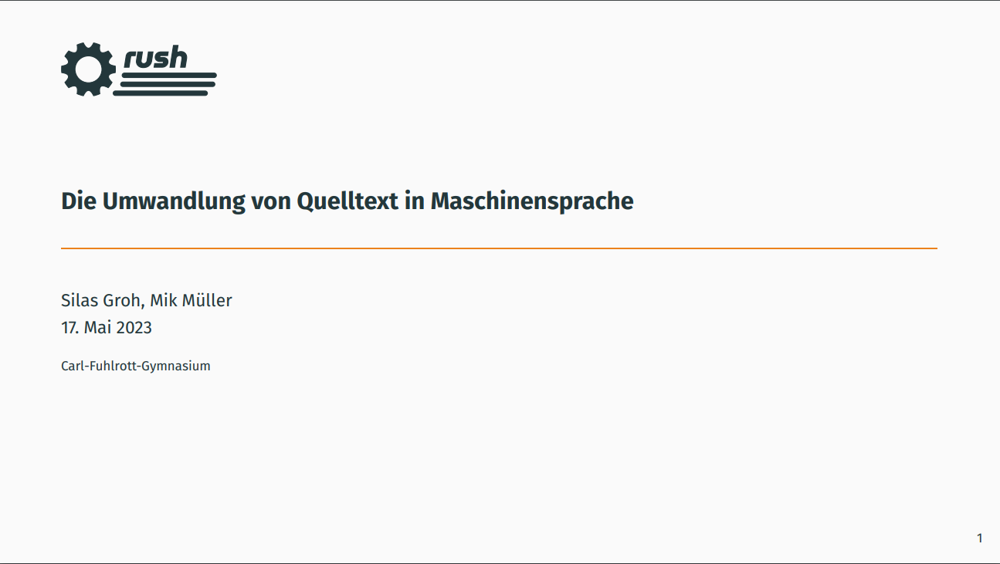

# Presentation

This repository contains the LaTeX sources of the projects defense presentation.

> Note: the current version of the presentation is visible at [this deployment](https://presentation.rush-lang.de)

## Building

- Clone the repository
- In the project directory, run `make init`
- Then, run `make build -j 1`

### Using docker

Alternatively, build the docker image of the `Dockerfile`, then run the
identical commands inside the Docker container

## Screenshot

> Note: the presentation is in German as it will be presented in a German school

